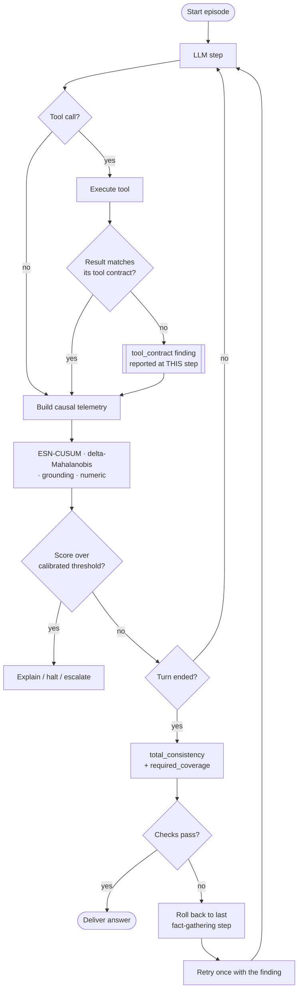

# DESIGN — Real-Time Detection and Repair of LLM Agent Failures

This document is the implementation contract. `derail/common.py` is the frozen
shared module (channel layout, dataclasses, `OnlineMonitor` ABC, `Standardizer`,
`rng_for`). Every module below imports from it and MUST match the signatures
given here exactly — the experiment runner is written against these signatures.

## Problem recap

An LLM agent executes an episode of steps t = 1..T; each step emits an
observable signal x_t = [e_t; u_t; m_t] (semantic embedding, token-uncertainty
aggregates, action metadata; layout in `common.py`). Episodes are healthy or
contain a derailment onset at unknown step τ, after which the trajectory
distribution shifts and the episode ends in failure at T_fail (= T−1, the last
step). From HEALTHY episodes only, learn a causal online monitor emitting a
derailment score s_t; alarm at τ̂ = min{t : s_t > θ}. Objectives: maximize
detection lead (T_fail − τ̂) at a fixed false-alarm budget, minimize delay
(τ̂ − τ) per failure class, produce calibrated alarm confidence, and support a
cost-optimal escalation policy to a (modeled) judge-LLM.

Hypotheses:
- **H1 (temporal)**: predictive temporal models (ESN ensemble) achieve longer
  detection lead than memoryless drift/threshold baselines at matched FA rate.
- **H2 (complementarity)**: u_t leads on grounding-loss; e_t leads on goal
  drift and looping; no single channel dominates all classes. (Core table.)
- **H3 (calibrated escalation)**: ensemble disagreement yields calibrated alarm
  confidence enabling an escalation policy that recovers most judge-LLM
  detection quality at a small fraction of its cost.

## Architecture

The whole system on one page: what is built offline, what runs per step, and
what happens on either verdict.


## Runtime flow

What actually happens per step at serving time.


The mermaid version below is the source of record: it lives in this file, so it
is diffable and cannot drift out of sync with the code the way an exported image
can. The diagram above is the same flow, drawn for presentation.



Three verdicts reach the operator, and they are not interchangeable.
`tool_contract` fires the moment a malformed result arrives, needing no null
and no answer. The behavioural monitors fire when the trajectory leaves the
healthy null, which requires a calibrated threshold. The answer checks fire
only once the agent commits to a total. Repair is driven by the answer checks:
a rollback re-runs the agent, which helps when the agent reasoned badly over
sound evidence, and cannot help when the tool itself is broken — a contract
violation is an escalation, not a retry.

## Repository layout

```
DESIGN.md  README.md  CLAIMS.md  DATA_CARD.md  REPRODUCE.md  CHECKSUMS.md
LICENSE  CITATION.cff  USER_GUIDE.md  requirements*.txt
derail/
  common.py                  # frozen contract: channels, Episode, OnlineMonitor
  config.py                  # API-key resolution (OS vault > env > .env)
  preconditions.py           # what the text readers refuse rather than pass
  telemetry/generator.py     # healthy simulator + failure injector
  telemetry/adapter.py       # real-trace JSONL -> Episode
  monitor/esn.py             # ESN ensemble (+ single-ESN ablation)
  monitor/baselines.py       # drift, entropy, Mahalanobis, isolation forest
  monitor/seq_baselines.py   # VAR-ridge, GRU, LSTM, TCN
  monitor/hybrid.py          # ESN + Mahalanobis fusion
  monitor/hmt_esn.py         # hierarchical multi-timescale ESN
  monitor/ngrc.py            # NG-RC/NVAR control: no random reservoir
  monitor/conceptor.py       # state-geometry arm (measured negative)
  monitor/grounding.py       # content-grounding telemetry channel
  monitor/grounding_verify.py# per-step numeric-grounding verifier
  monitor/baseline.py        # self-calibrating rolling healthy reference
  monitor/calibration.py     # confidence calibration + ECE
  monitor/escalation.py      # judge model + escalation policies + costs
  harness/                   # live agent loop, tools, sandbox, injector, replay
  verify/checks.py           # deterministic answer / coverage / contract checks
  intervene/                 # rollback + repair-policy evaluation
  evaluation/                # metrics, protocol, paired significance tests
  experiments/               # study runners, collectors, plots, live demo
devtools/                    # manifest, snapshot, audits, ledger, data card
verification/  experimental/ # pre-registered arms and exploratory studies
tests/  traces/  results/  paper/
runs/                        # runtime output of serving runs (gitignored)
```

**Collection writes to `traces/`; serving does not.** `traces/` is the frozen
research corpus `BASELINE_MANIFEST.json` hashes, so a run that merely *serves*
the monitor — the demo, an ad-hoc live slice — must not add to it, or the
dataset every published number is computed from would depend on who last ran
the demo. Collectors legitimately write there, because their recordings are
the dataset. The split is one flag: `Cassette(..., serving=True)` reads the
committed recordings and records any new one under `runtime_root()`
(`runs/`, or `AGENTWATCH_RUNTIME_DIR`). Pinned by
`test_serving_paths_cannot_write_into_the_committed_corpus`.

**Nor do tool fixtures live in `traces/`.** The `sql_query` tool's e-commerce
database was a committed 16 KB binary at `traces/ecommerce.db` — a fixture
inside the episode corpus, uploaded with the published Hugging Face dataset,
absent from the integrity manifest, and with nothing in the repo able to
rebuild it. Its source of truth is now
`derail/harness/fixtures/ecommerce_seed.sql`: plain SQL, diffable, hashed with
the code, and rebuilt on demand into `runtime_root()/fixtures/` (atomically,
so concurrent agents never see a half-written file). Same rows, same
read-only enforcement (`mode=ro` plus `PRAGMA query_only`), one fewer binary
in the dataset.

Every library module carries an `if __name__ == "__main__":` smoke test that
uses only that module + `derail.common` + third-party libs (NO sibling `derail`
imports — construct synthetic `Episode`s with random X where needed) and prints
a short PASS summary. `tests/test_module_selftests.py` runs them all as
subprocesses, split into a fast set and a `slow`-marked set: most finish in
under two seconds, a few (`seq_baselines`, `hybrid`, `hmt_esn`, `ngrc`,
`demo_real`) need longer because they fit real models.

Python 3.13+ (developed on 3.14). Core dependencies are numpy / scipy /
scikit-learn / pandas, plus httpx for the Ollama backend; matplotlib is used
only by `plots.py`, and torch only by the sequence baselines. Determinism: all
randomness flows through `rng_for(seed, *tags)`.

---

## Component contracts at a glance

The per-step call sequence, end to end — who calls whom, in what order, and
where a verdict can be raised:


And the objects those interactions run over — the frozen `common.py` contract,
the `OnlineMonitor` implementations, and the verification and repair layers:


The module contracts below are the authority; these two diagrams are a map into
them.

## Module 1 — `derail/telemetry/generator.py`

Healthy-episode simulator + failure injector in one module (they share
dynamics). Public API:

```python
class EpisodeGenerator:
    def __init__(self, cfg: SimConfig, seed: int) -> None: ...
    def generate(self, episode_id: str, failure: FailureSpec | None) -> Episode: ...

def sample_failure_spec(failure_class: str, T: int, rng: np.random.Generator,
                        cfg: SimConfig) -> FailureSpec:
    # tau ~ round(Uniform[cfg.tau_frac_min, cfg.tau_frac_max] * T_planned)
    # severity ~ Uniform[severity_min, severity_max]
    # ramp_steps ~ int, longer for lower severity (subtle onsets ramp slowly)

def make_dataset(ds_cfg: DatasetConfig, sim_cfg: SimConfig) -> dict[str, list[Episode]]:
    # returns {"train": [...healthy...], "val": [...healthy...],
    #          "cal": [...healthy + injected...], "test": [...healthy + injected...]}
    # Injected counts per DatasetConfig; per-episode RNG via
    # rng_for(master_seed, split, index). episode_id = f"{split}-{i:04d}".
```

Episode-length mechanics: a healthy episode has planned length T_planned ~
Uniform[T_min, T_max]. An injected episode runs healthy dynamics until τ, then
failure dynamics for `horizon = fail_horizon_min..max` steps (sampled; smaller
for higher severity), ending at t_fail = τ + horizon = T − 1. So injected
episodes may end before or after T_planned; that's fine (budget exhaustion).

### Healthy dynamics (requirements, internals free)

- **Semantic e_t** (dims 0..31): unit-normalized. Latent goal g ~ unit sphere.
  k ~ Uniform[n_waypoints_min, n_waypoints_max] subtask waypoints
  w_i = normalize(g + waypoint_sigma · ε). The agent visits waypoints in order
  (dwell a few steps each), with progress-dependent pull toward g
  (`pull_goal`), plus AR(1) noise (rho `ar_rho`, innovation `ar_sigma`).
  Include benign irregularities: occasional brief revisits of the previous
  waypoint, small corrections — healthy must NOT be trivially smooth.
- **Uncertainty u_t** (dims 32..35): mean entropy = entropy_base[action] −
  entropy_completion_drop · progress + noise, clipped ≥ 0.05. max entropy =
  mean + |noise|. slope: healthy ≈ N(−0.05, 0.1). high-entropy fraction:
  increasing function of mean entropy + noise, clipped to [0, 1]. Occasional
  benign entropy spikes (decision points).
- **Metadata m_t** (dims 36..42): action type follows a sticky-ish Markov
  chain over ACTION_TYPES with the natural cycle plan → tool_call →
  tool_result → (sometimes synthesis) → …; identical action rarely repeats
  3+ times consecutively in healthy runs. latency_log ~ N(mu, sigma) per
  action type (cfg.latency_lognorm gives (mu, sigma) of log-seconds).
  outlen_log ~ N per type. error_flag ~ Bernoulli(healthy_error_rate) with
  immediate recovery (no consecutive errors in healthy runs); after an error
  the agent retries (repeat tool_call) once.

### Failure dynamics per class (the paper's core; get the channel signatures right)

All failures ramp in over `ramp_steps` (geometric/linear blend from healthy to
failed dynamics) — no step discontinuities. Severity scales effect sizes;
severity_min episodes must be genuinely hard (near-healthy at onset).

1. **goal_drift** — distractor goal g′ (unit vector, moderate angle from g).
   After τ, effective goal/waypoints rotate toward g′ at a rate ∝ severity;
   the agent proceeds *confidently*: entropy normal or slightly reduced,
   metadata normal. Signature: gradual semantic rotation; e_t leads.
2. **looping** — at τ, capture the last L ∈ {2,3,4} semantic states; cycle
   through them with small noise. Action types repeat the same short cycle
   (e.g. tool_call → tool_result → tool_call …) with identical-ish
   latencies/output lengths; entropy slightly DECREASES (confident
   repetition). Progress stalls: no waypoint advance, no entropy decline.
   Signature: periodicity + violated progression; e_t and m_t lead.
3. **tool_cascade** — error_flag probability ramps to 0.6–0.9·severity;
   latencies inflate ×(2–6); action types dominated by tool_call/tool_result
   retry pairs; semantic states ping-pong between an "attempt" state and an
   "error-processing" state; mean entropy rises moderately with retries.
4. **grounding_loss** — the SUBTLE one: semantic trajectory stays plausible
   (continue waypoint progress with pull reduced only mildly, ×(1 −
   0.3·severity)); the uncertainty channel shifts: mean entropy +(0.4–
   1.0)·severity ramp, high-entropy fraction up, slope flattens → positive,
   sporadic max-entropy spikes. Metadata normal. Signature: u_t leads, e_t
   nearly blind. This class anchors H2 — keep the semantic shift small.
5. **context_corruption** — predictability collapses: ar_rho drops toward
   0.2, ar_sigma inflates ×(2–4), semantic mean random-walks off the goal
   manifold slowly; action Markov chain → near-uniform random; entropy
   VARIANCE inflates (mean roughly unchanged); output length erratic.
   Signature: step-to-step dynamics break; temporal models should shine.

Smoke test: generate ~20 healthy + 2 per class, assert Episode invariants
hold, print per-class mean |Δx| between pre-τ and post-τ segments per channel
group (sanity: goal_drift moves e, grounding_loss moves u ≫ e, etc.).

---

## Module 2 — `derail/monitor/esn.py`

Echo-state-network ensemble monitor. Public API:

```python
class ESNEnsembleMonitor(OnlineMonitor):
    def __init__(self, standardizer: Standardizer, channels: tuple[str, ...] = ("e","u","m"),
                 K: int = 8, reservoir_size: int = 128, spectral_radius: float = 0.9,
                 leak_rate: float = 0.3, input_scale: float = 0.5, density: float = 0.1,
                 ridge_lambda: float = 1e-2, beta_disagreement: float = 0.5,
                 ewma_alpha: float = 0.35, seed: int = 0, name: str | None = None) -> None: ...
    # OnlineMonitor interface: fit / start_episode / score_step
    def score_episode_components(self, episode: Episode) -> dict[str, np.ndarray]:
        # {"fused": (T,), "surprise": (T,), "disagreement": (T,)} — each the
        # EWMA-smoothed causal streams used for alarms/calibration.
```

- `channels` selects which slices of x_t (via CHANNEL_SLICES) the monitor
  sees, concatenated — used for the H2 ablation (("e",), ("u",), ("m",),
  ("e","u"), ("e","u","m")). `name` defaults to `esn[{channels}]K{K}`.
- Input: standardizer.transform(x), then column-select channels.
- Each ESN k: sparse reservoir W (density, rescaled to spectral_radius),
  input weights ±input_scale, leaky-tanh state update
  h_t = (1−leak)·h_{t−1} + leak·tanh(W h_{t−1} + W_in x_t). Readout: ridge
  regression from [h_t; x_t; 1] to x_{t+1} (z-scored space). Different seed
  per member (rng_for(seed, "esn", k)).
- **fit(healthy_episodes)**: split episodes 85/15 (by episode, deterministic).
  Ridge on the 85% (teacher-forced runs, skip washout = first 3 steps of each
  episode). On the held-out 15%: per-dim residual std σ_err (floor 1e-3), and
  the healthy distributions of raw surprise and raw disagreement used to
  z-normalize each (robust: median/IQR-based location-scale).
- **score_step(x_t)** (causal): at step t, surprise_t = mean over K of
  mean_d(((x̂_t|k − x_t)/σ_err)²) where x̂_t|k was predicted at t−1;
  disagreement_t = mean_d(std over K of x̂_t|k / σ_err). First step (and
  washout steps 0..2): score 0. Fused raw score = z(surprise) +
  beta_disagreement · z(disagreement); the emitted s_t is an EWMA
  (alpha=ewma_alpha) of the fused raw score — still causal. Then predict
  x̂_{t+1} for the next call.

`SingleESNMonitor` is just `ESNEnsembleMonitor(K=1, name="esn_single")` — the
runner constructs it; no extra class needed.

Smoke test: fit on ~30 synthetic random-walk Episodes (build inline), check
scores finite, shape (T,), and that a perturbed episode (add noise after
t=20) scores higher post-perturbation on average.

---

## Module 3 — `derail/monitor/baselines.py`

All implement `OnlineMonitor`. Constructors take `standardizer` where noted.

```python
class CosineDriftMonitor(OnlineMonitor):        # name="cosine_drift"
    def __init__(self, warmup: int = 5) -> None: ...
    # centroid = mean of e_1..e_warmup (causal, per-episode); score_t =
    # 0 for t < warmup, else 1 − cos(e_t, centroid).

class RollingEntropyMonitor(OnlineMonitor):     # name="rolling_entropy"
    def __init__(self, ewma_alpha: float = 0.3) -> None: ...
    # fit: healthy mean/std of mean-entropy dim (IDX_MEAN_ENTROPY).
    # score_t = EWMA of |z(mean_entropy_t)| (two-sided: drops are anomalous too).

class MahalanobisMonitor(OnlineMonitor):        # name="mahalanobis"
    def __init__(self, standardizer: Standardizer) -> None: ...
    # Ledoit-Wolf covariance on pooled standardized healthy steps;
    # score_t = Mahalanobis distance of standardized x_t. Memoryless.

class DeltaMahalanobisMonitor(OnlineMonitor):   # name="delta_mahalanobis"
    def __init__(self, standardizer: Standardizer) -> None: ...
    # Same but on [x_t ; x_t − x_{t−1}] (86-dim); x_{−1} := x_0. A STRONG,
    # ~51x-cheaper 1-lag baseline (beats the ESN on >=1 real tool-cascade
    # metric) that makes H1 falsifiable -- not a straw-man.

class IsolationForestMonitor(OnlineMonitor):    # name="iforest"
    def __init__(self, standardizer: Standardizer, n_estimators: int = 200,
                 seed: int = 0) -> None: ...
    # Fit on pooled standardized healthy steps; score = −decision_function.
```

Smoke test: fit each on synthetic healthy Episodes, score one episode, assert
finite/(T,) shapes and that an obviously-shifted episode scores higher.

---

## Module 4 — `derail/monitor/calibration.py`

```python
class NullCalibrator:
    """Label-free confidence: ECDF of per-episode MAX score on healthy val."""
    def fit(self, val_healthy_max_scores: np.ndarray) -> "NullCalibrator": ...
    def confidence(self, running_max_score: float | np.ndarray) -> np.ndarray:
        # 1 − p-value under the healthy-max ECDF, i.e. rank-based; in [0,1].
        # (Hazen plotting position; clip to [1/(2n), 1 − 1/(2n)].)

class IsotonicCalibrator:
    """Oracle upper bound: isotonic regression fit on the labeled cal split."""
    def fit(self, cal_max_scores: np.ndarray, cal_labels: np.ndarray) -> ...: ...
    def confidence(self, max_scores) -> np.ndarray: ...

def ece(confidences: np.ndarray, labels: np.ndarray, n_bins: int = 10) -> float:
    # standard expected calibration error, equal-width bins on [0,1]

def reliability_curve(confidences, labels, n_bins=10) -> pd.DataFrame:
    # columns: bin_center, mean_confidence, empirical_freq, count  (skip empty bins)
```

Episode-level confidence = calibrator.confidence(max_t s_t) — the runner
computes it on test episodes; labels are is_injected. Both calibrators are
evaluated for three score streams (fused / surprise-only / disagreement-only)
to test whether disagreement improves calibration (H3).

Smoke test: synthetic scores where injected ~ N(2,1), healthy ~ N(0,1);
check ECE(NullCalibrator) reasonable, IsotonicCalibrator ECE lower,
reliability_curve monotone-ish.

---

## Module 5 — `derail/monitor/escalation.py`

Modeled judge + policies + cost accounting (constants from common:
COST_STEP, COST_JUDGE, JudgeConfig).

```python
def judge_verdict(episode: Episode, t: int, judge: JudgeConfig,
                  rng: np.random.Generator) -> bool:
    # True w.p. p_detect if (not episode.is_healthy and t >= episode.tau)
    # else True w.p. p_false.

@dataclass
class PolicyOutcome:
    episode_id: str; is_healthy: bool; failure_class: str | None
    halted_at: int | None      # step of halt, None if ran to completion
    judge_calls: int
    cost: float                # see cost model below
    detected: bool             # halted at t >= tau (injected only)
    lead: int | None           # T−1 − halted_at if detected else None

def run_policy(policy: str, episodes: list[Episode],
               scores: dict[str, np.ndarray],          # episode_id -> s_t stream
               confidences: dict[str, np.ndarray] | None,  # running conf streams
               theta_soft: float, judge: JudgeConfig, seed: int,
               conf_threshold: float | None = None) -> list[PolicyOutcome]:
```

Policies (all causal, judged step-by-step with debounce/cooldown from
JudgeConfig):
- `"never"` — run every episode to the end. Baseline floor.
- `"judge_every_step"` — judge called at every step; halt on `debounce`
  consecutive positives. Upper baseline.
- `"halt_on_alarm"` — halt immediately at first s_t > theta_soft (blunt).
- `"escalate_on_alarm"` — while s_t > theta_soft, call the judge; halt on
  `debounce` consecutive positives; after a negative, suppress escalation
  `cooldown` steps. If conf_threshold is not None, escalate on
  running-confidence > conf_threshold instead of raw score (used to sweep
  the cost–quality frontier over conf_threshold).

Cost per episode = COST_STEP · (steps actually executed) + COST_JUDGE ·
judge_calls + waste, where waste is: for injected episodes, steps executed
at t > τ are already counted (they ARE the waste — no double count; halting
early saves them); for healthy episodes halted at t_h, add COST_STEP ·
(T − 1 − t_h) redo-penalty (lost work must be redone). Report per-policy:
mean cost/episode, detection rate, mean lead, healthy wrongful-halt rate,
and cost ratio vs judge_every_step.

Smoke test: two synthetic episodes (one healthy, one injected with a score
step-up at τ), run all four policies, print outcomes; assert
judge_every_step detects and escalate_on_alarm costs less than it.

---

## Module 6 — `derail/evaluation/metrics.py`

```python
def first_alarm(scores: np.ndarray, theta: float) -> int | None: ...

def pick_threshold(val_healthy_scores: list[np.ndarray], fa_budget: float = 0.05) -> float:
    # (1 − fa_budget) quantile (method="higher") of per-episode max scores.

def evaluate_alarms(episodes: list[Episode], scores: dict[str, np.ndarray],
                    theta: float) -> pd.DataFrame:
    # one row per episode: episode_id, is_healthy, failure_class, tau, T,
    # alarm_step, outcome in {"true_alarm","early_alarm","miss","false_alarm",
    # "correct_silence"}, delay (τ̂−τ, true alarms), lead (T−1−τ̂, true alarms),
    # budget_saved_frac = lead/(T−1). Early alarm = alarm before τ on an
    # injected episode (counts as a false alarm; not a detection).

def summarize(df: pd.DataFrame) -> dict:
    # healthy_fa_rate, early_alarm_rate, detection_rate (true alarms /
    # injected), median_delay, median_lead, mean_budget_saved, per-class
    # dict of {detection_rate, median_delay, median_lead}.

def episode_auc(episodes, scores) -> float:
    # ROC-AUC of per-episode max score, healthy(0) vs injected(1).

def delay_fa_curve(val_healthy_scores, test_episodes, test_scores,
                   quantiles=np.linspace(0.5, 0.999, 25)) -> pd.DataFrame:
    # per θ-quantile: realized healthy-test FA rate, detection rate,
    # median delay, median lead.

def bootstrap_ci(values: np.ndarray, stat=np.median, n_boot: int = 1000,
                 seed: int = 0, ci: float = 0.95) -> tuple[float, float]: ...
```

Smoke test: hand-built scores/episodes with known alarms; assert outcomes,
delay/lead arithmetic, threshold quantile, and AUC on a separable toy case.

---

## Module 7 — `derail/experiments/run_experiment.py`

End-to-end runner; writes everything under `results/`. Must be runnable as
`py -m derail.experiments.run_experiment [--quick]` from the repo root
(`--quick` = quarter-size dataset, K=4, for integration testing).

Steps:
1. `make_dataset(DatasetConfig(), SimConfig())`; fit `Standardizer` on train.
2. Build monitors: `esn_full` (K=8), `esn_single` (K=1), channel ablations
   esn[e], esn[u], esn[m], esn[e,u] (K=8), cosine_drift, rolling_entropy,
   mahalanobis, delta_mahalanobis, iforest. Fit all on train.
3. Score val-healthy, cal, test episodes with every monitor (dict
   episode_id → np.ndarray). Save compressed scores to
   `results/scores/{monitor}.npz` (keys = episode ids) plus an episode
   metadata CSV (id, split, is_healthy, failure_class, tau, T, severity).
4. **H1**: θ per monitor at fa_budget=0.05 on val; `evaluate_alarms` +
   `summarize` on test → `results/tables/h1_main.csv` (one row per monitor:
   detection_rate, healthy_fa_rate, early_alarm_rate, median_delay
   [+bootstrap CI], median_lead [+CI], mean_budget_saved, episode AUC).
   Also `delay_fa_curve` per monitor → `results/tables/delay_fa_curves.csv`
   (long format, column monitor).
5. **H2**: for the 5 ESN channel variants × 5 failure classes: detection
   rate, median delay, median lead at the same per-monitor θ →
   `results/tables/h2_channels.csv` (long format).
6. **H3a calibration**: for esn_full, get component streams on val/cal/test
   (`score_episode_components`). For each stream (fused, surprise,
   disagreement): NullCalibrator on val-healthy max-scores, IsotonicCalibrator
   on cal max-scores+labels; confidence on test; ECE + reliability_curve →
   `results/tables/h3_calibration.csv` and `h3_reliability.csv`.
7. **H3b escalation**: theta_soft = fused θ at fa_budget=0.10 (softer);
   policies never / judge_every_step / halt_on_alarm / escalate_on_alarm on
   test episodes; plus escalate_on_alarm swept over conf_threshold ∈
   {0.5,0.7,0.8,0.9,0.95,0.99} using Null-calibrated running confidence →
   `results/tables/h3_escalation.csv` (policy, params, mean_cost,
   detection_rate, mean_lead, wrongful_halt_rate, cost_ratio_vs_judge).
8. `results/results.json`: config echo, headline numbers, per-hypothesis
   verdict strings; print a readable console summary at the end.

Use `rng_for(MASTER_SEED, "runner", ...)` for any runner-level randomness.
Wall-clock target: full run < 10 min on CPU; keep everything vectorized.
Do NOT run the experiment in the smoke test — `__main__` IS the experiment.

---

## Evaluation protocol notes (all modules)

- One-class discipline: monitors fit on train (healthy) only. θ from val
  (healthy) only. The cal split (labeled) is used ONLY by IsotonicCalibrator
  (the oracle) and nothing else. All reported numbers from test.
- Causality: every score stream must be computable online (no future info,
  no per-episode post-hoc normalization using full-episode stats).
- Failure accounting: an alarm before τ on an injected episode is an early
  (false) alarm, NOT a detection.
- Determinism: same MASTER_SEED ⇒ identical results.json.

---

## Post-contract amendments (integration + adversarial review)

1. **CUSUM stream family** (`ESNEnsembleMonitor(cusum=True, cusum_k=0.5)`):
   emits one-sided CUSUM accumulators of the fused/component z-scores instead
   of EWMAs. Motivation: slow goal drift keeps every step locally predictable,
   so short-memory EWMA surprise never crosses threshold; CUSUM integrates
   small persistent shifts. The runner runs both families, and H2's channel
   verdict reads the CUSUM singles. (The H1 primary was later superseded by
   the channel-max variant — see amendment 8.)
2. **SelfDriftMonitor** baseline (`self_drift`): 1 − cos(e_t, running mean of
   the episode's PAST e). Trajectory self-consistency with O(1) state — the
   only monitor family that catches slow goal drift (which evades all
   per-step-surprise channels, CUSUM included). Reported in H2 as the
   family-complementarity axis.
3. **Survivorship-free lead metrics**: `summarize` adds `mean_lead_all` /
   `mean_budget_saved_all` (all injected episodes; miss/early = 0). H1's
   verdict uses mean_lead_all with a bootstrap CI, because median lead among
   detected episodes rewards monitors that only catch easy cases.
4. **Escalation cost split**: `summarize_policy` adds `mean_judge_calls`;
   the escalation table adds `judge_call_ratio` (monitoring overhead vs
   judging every step — the problem statement's "cost ratio") alongside the
   total-cost ratio, which is dominated by the agent's own steps.
5. **Cal-split operating-point selection** (review finding, confirmed): the
   escalate_on_alarm conf_threshold is selected on the labeled cal split and
   only its test row becomes the H3b headline; selecting on test was a
   winner's-curse leak. The full test sweep remains in h3_escalation.csv.
6. **Prevalence matching** (review finding, confirmed):
   `n_cal_injected_per_class` = 60 so cal's injected fraction (300/420)
   matches test's (400/560); the isotonic oracle is fit at the prevalence it
   is evaluated at.
7. **H3 streams** come from the primary monitor (`esn_cusum_max`), keeping
   the calibration/escalation story on the same instrument as H1.
8. **Channel-max primary** (`ChannelMaxESNMonitor`, `esn_cusum_max`): one
   ESN-CUSUM detector per channel fused by max — motivated by the dilution
   finding (monolithic surprise averages a 4-dim uncertainty shift into 43
   dims). H1_PRIMARY points here.
9. **Statistical tests** (`evaluation/stats.py`): paired sign-flip
   permutation, Wilcoxon signed-rank, and exact McNemar, primary vs every
   monitor, paired by test episode → `tables/h1_significance.csv`.
10. **Trained sequence baselines** (`monitor/seq_baselines.py`): linear
    VAR (`linear_ar`), GRU, LSTM, TCN under the identical one-class,
    causal, CUSUM-emission protocol; optional `channels=` restriction for
    wrapper-parity experiments. torch is an optional dependency.
11. **Auxiliary studies**: `run_multiseed.py` (5-seed mean±std; all
    verdicts SUPPORTED every seed), `run_ablation.py` (no tuning cliff),
    `run_benchmark.py` (per-step latency; primary ≈ 190 µs),
    `run_fairness.py` (GRU/LSTM convergence verified; the channel-max
    wrapper — not the reservoir — carries most of the margin over
    monolithic sequence models; the ESN keeps a modest edge and ~100×
    faster fitting).
12. **Real-trace pipeline** (weaknesses A/B): `telemetry/adapter.py`
    (JSONL → Episode; surprisal-based u channel), `experiments/
    collect_traces.py` (live Gemini agent on mock tools with injection at
    known τ; secure key handling via `derail/config.py` — OS credential
    vault; OS trust store for TLS-intercepting AV), `experiments/
    run_real_traces.py` (fit/evaluate on real traces; channel set driven
    by logprobs availability — tier-gated on free Gemini keys). Findings
    on a 187-episode corpus, scored on the held-out split of 94 it yields
    (79 injected + 15 healthy) and not on all 187: channel-max AUC 0.840
    at 20% realized FA (15 healthy test episodes, so one episode is worth
    6.7 points, and the 16 validation episodes cannot deliver a 5% budget
    at all); looping 1.00,
    cascade 0.83, abrupt goal drift 0.77, corruption 0.29; slow drift
    remains the simulator-documented hard case.

13. **Telemetry v3 — derived x channel (post-review amendment)**:
    `common.py` registers an OPTIONAL extended layout `D_TOTAL_EXT = 51`
    (`CHANNEL_SLICES["x"]`, dims [43, 51)) computed causally by
    `telemetry/adapter.py` (`step_signal_ext` / `episode_from_trace(...,
    extended=True)`) for REAL-TRACE pipelines only; the simulator, the core
    43-dim study, and every existing experiment are unchanged (Episodes may
    be 43- or 51-wide; monitors select channels by name as before). The
    eight derived dims: cosine embedding drift vs previous step; similarity
    to the task anchor (step-0 embedding); per-step tool success rate;
    retry count (exact repeats of earlier (name, args) calls); log per-tool
    latency; approximate context-utilization ratio (cumulative tokens /
    8192 budget, capped at 2); reasoning depth (# tool calls in the step);
    self-consistency (cosine vs the run's running-mean embedding). Tool
    calls are parsed from the v2 step-text format "[name({args}) ->
    result]" so stored traces and live loops share one code path. The demo
    (`experiments/demo.py`) runs a fourth per-channel ESN-CUSUM detector on
    "x" (max fusion, same one-class cross-fit calibration) and its
    explainability panel splits the x channel per-dim by accumulated
    normalized squared prediction error.

### Amendment 3 — optional content-grounding channel g_t (exp/grounding-channel)

Motivation: measured across seven datasets, behavioral (ESN), statistical
(Mahalanobis), and fused hybrid monitors all sit near zero detection on the
content-corruption classes (context_corruption, wrong_document,
malformed_json) — corrupted *data values* do not change the *behavior*
those monitors observe. This is a missing information source, so it enters
as a new optional telemetry channel, not a new monitor trick.

Contract:
- `D_GRD = 9`, `D_TOTAL_GRD = 60`; `CHANNEL_SLICES["g"] = slice(51, 60)`.
- Episodes may now be 43, 51, or 60 wide. Monitors selecting only
  ("e","u","m") or ("e","u","m","x") behave IDENTICALLY on all widths;
  nothing existing changes meaning (verified: published tables reproduce).
- The channel exists only when `telemetry.adapter` is called with
  `grounding=True` (explicit; implies extended=True). Defaults unchanged.
- Dims (all causal, all oriented higher = more anomalous, all computed
  from the v2 step text's tool bits with the same hash embedding):
  51 query↔result dissimilarity (wrong_document), 52 result↔reasoning
  dissimilarity, 53 result self-inconsistency vs the episode's running
  result centroid (context_corruption), 54 JSON structural breakage —
  flagged ONLY when the result cannot be completed to valid JSON by
  closing open strings/brackets, so storage truncation is never a false
  positive (fixes an earlier JSON-validity false-positive), 55
  character-statistics anomaly (alnum-ratio shift + non-printable
  fraction), 56 result↔previous-result dissimilarity (consecutive-step
  drift), 57 causal EWMA (α 0.4) of the self-inconsistency dim (persistent
  drift), 58 agent-text↔3-step result-memory dissimilarity, 59 lexical
  retrieval-relevance miss for DOCUMENT results (BM25-style; the demo
  monitor excludes this offline dim via `GRD_DIM_NAMES[:-1]`).
- On v1 traces (no "-> result" in step text) all nine dims are exactly 0:
  inert, monitors fitted on them threshold at 0 and never alarm on g.
- Citation/claim grounding is out of scope for the current task suite (no
  citation structure in the harness tasks); noted for future work.

### Amendment 4 — context-corruption grounding dims + override fusion (exp/context-corruption)

Diagnosis (quantified on real_research7b): the grounding stream at its own
5%-FA threshold detects 17/22 context_corruption episodes; the max-union
detects 1 — 16 detections lost because the fused val threshold is set by
behavioral-tail healthy outliers (one val episode at 8.26 q_b vs context
evidence at 1.5–2.6 q_g). Fusion, not information, was the bottleneck.

Contract changes:
- `D_GRD` 5 → 8 (`D_TOTAL_GRD` = 59): adds 56 consecutive-result
  dissimilarity (1 − cos vs the previous step's results), 57 grounding
  drift (causal EWMA, alpha 0.4, of the centroid dissimilarity), 58
  reasoning↔memory dissimilarity (agent text vs the mean of the last 3
  steps' result embeddings). All causal, higher = anomalous, inert-zero
  on v1 traces, computed with the standard hash embedding.
- `_GroundedBase.fit` additionally records `_g_trip`: the healthy-train
  MAXIMUM of the normalized grounding stream. Fusion strategies that
  override on grounding evidence trip at this level ("no healthy training
  episode ever reached this") rather than at a split val-quantile budget,
  which collapses to theta = max at realistic val sizes (24 episodes) and
  destroys the behavioral stream's budget.
- New fusion monitors (grounding.py): HybridContentGate (behavioral score
  + 10·relu(z_g − trip) override), HybridAdaptive (sigmoid-weighted soft
  gate); dual-budget OR deployment implemented at the runner level
  (behavioral stream keeps the full val budget, grounding trips at
  train-max; realized FA reported).

### Amendment 5 — binary lexical relevance dim + clean-null override (exp/wrong-document)

- `D_GRD` 8 → 9 (`D_TOTAL_GRD` = 60): dim 59 `lex_miss` — 1.0 iff a
  document-like tool result (>= 4 content words; not an error string, a
  parenthesized tool diagnostic, or structured JSON) shares ZERO content
  words with both its query args and the task text. Pure string ops
  (~2 µs/result; no embedding). Root cause it fixes: char-trigram cosine
  has a hopelessly noisy healthy null for retrieval relevance (healthy
  0.65 ± 0.26 vs wrong 0.91), and even continuous term coverage leaves
  healthy tangential documents a hair from decoys; the zero-overlap
  indicator separates almost perfectly (28/28 wrong_document episodes,
  3/330 healthy across five datasets).
- Override contract: the binary dim NEVER enters the continuous grounding
  stream's trip calibration (hybrids receive a continuous-dims
  GroundingMonitor). It acts as (a) a direct additive override in
  gate/adaptive fusions and a third OR-clause in dual-budget, but ONLY in
  domains where healthy train episodes show zero flags (`_lex_clean` —
  one-class self-calibration; it self-disables where its null is dirty);
  (b) a raw fourth feature of HybridLogisticG, where cross-fit supervised
  weights price it per domain (covers dirty-null domains when labels
  exist).
- MiniLM evaluated as required by the task and NOT adopted: 4.4 ms/text
  encode + 5.7 s load (measured, cached model) vs 2 µs for the lexical
  flag, for no additional wrong_document coverage on this corpus.

### Amendment 6 — degenerate-scale contract and threshold feasibility

Found while auditing why a 10% false-alarm budget realized 18–32% on the
organic demo corpora. One mistake, repeated in five places.

**The defect.** Wherever a monitor divides by a scale estimated from healthy
data, that scale can be exactly zero — the quantity simply never varied in
healthy runs. Every site clamped it to a small epsilon (1e-9, 1e-6, 1e-3),
which turns the division into a huge gain: a channel carrying NO calibrated
information becomes the most sensitive one in the system. Measured end to end:
`IDX_RETRY_COUNT` (dim 46) is constant zero across healthy demo-task runs, so
one benign repeated tool call gave `z = 1/1e-3 = 1000`, which the ESN squared
and compounded against its own floored `_sigma_err` to ~1e11. Healthy episodes
reached peaks of **1.015e9 against a corpus median of 0.458** — three of them
the identical value — and those episodes then set the alarm threshold for the
whole corpus.

**The contract (`common.safe_scale`).** A degenerate scale is replaced by
**1.0**, not by an epsilon: the deviation is reported RAW, in the quantity's
own units. That keeps a genuinely novel event visible — a first-ever error
flag still registers — without inventing a sigma count no healthy data
supports. Applied at all five sites:

| site | quantity |
|---|---|
| `common.Standardizer.fit` | per-dim telemetry std (dims with real variation keep the 1e-3 floor) |
| `esn._robust_loc_scale` | surprise / disagreement IQR scale |
| `ESNEnsembleMonitor.fit` | per-dim residual std `_sigma_err` |
| `hybrid._robust_stats` | sub-monitor score MAD scale |
| `demo.StreamingContentGate.fit` | `_q_b` / `_q_g` stream quantiles |

**Effect.** On `traces/organic_demo7b_ext` the maximum healthy peak falls from
1.015e9 to **2.99** (median unchanged at 0.458), and per-fold θ tightens from
`[323433, 135133, 130, 117733, 103608]` to `[311, 281, 281, 311, 288]` — a
2478× spread down to 1.1×. On `organic_demo7b` a fold at θ = 7.3e10 becomes
621.

**Why no committed number moves.** The simulator has **zero** degenerate dims,
and every real study corpus has 2–9 of them but **no held-out healthy episode
ever deviates on one** (max |z| = 0), so the amplifier never fires there:
`0 / 1e-3` and `0 / 1.0` are both 0. `devtools.behavior_snapshot --check`
reports behaviour identical, and the full fast gate passes.

**What this does NOT fix.** The remaining per-fold θ variation on
`organic_demo7b_cold` (`[1727, 1727, 1727, 96, 1727]`) is not this defect: the
healthy maxima there run 30 → 2815 *continuously*, with 8 of 74 above 1000. A
90th percentile of a genuinely heavy-tailed sample is simply noisy, which is
an estimator-variance property, not a bug.

**Threshold feasibility.** `metrics.min_calibration_episodes(b)` = ceil(1/b−1).
An empirical threshold read off the maxima of n healthy episodes cannot deliver
an expected FA below 1/(n+1), because a fresh healthy episode exceeds the max
of n exchangeable ones with exactly that probability. `pick_threshold` now
warns when asked for an unreachable budget instead of silently missing it.
Measured on six real corpora at a 5% budget: realized 8.2%, with four corpora
calibrating on 12–15 episodes and sitting exactly on their 6–8% floor.
`pick_threshold(..., method="lognormal")` extrapolates the tail and escapes
that floor (realized FA 6.7% for 3.0 points of detection, 50.8% → 47.8%); it is
available but is not the default anywhere, since on corpora where the empirical
rule already lands near the budget the tail fit overshoots it.

### Module 8 — `derail/verify/checks.py` (deterministic answer verification)

The dominant organic failure on the demo task is
behaviourally quiet: the agent prices every leg correctly, sounds confident,
and combines the numbers wrongly. The behavioural monitor does detect it
(arithmetic AUROC 0.733, 0.824 held out) but only at a 17% false-alarm cost and
only with a calibration corpus fitted per configuration. The answer, by
contrast, is *checkable* — and a check needs neither.

**Contract.**

- **Inputs:** the run's own steps. The checks may read only the tool calls the
  agent made and the results it received. They may NOT read the world the task
  was generated from — that is the study's oracle (`_demo_expected_total`) and
  is not deployable. Enforced by `test_checks_never_read_the_hidden_world`,
  which parses the module rather than grepping it.
- **No reference distribution.** No null, no threshold, no FA budget, no
  calibration corpus. Nothing to recollect when the model, decoding config,
  toolset, task or framework changes — the axis-by-axis recalibration the
  one-class monitors require does not apply.
- **Genericity split.** The mechanisms are task-independent; the per-task part
  is a small `TaskSpec` (which tools return line items, with what multiplier
  and how many distinct lookups are required). Written once from the task
  statement, not harvested from calibration runs.
- **Weaker than the oracle, by construction.** An agent that looks up the
  wrong city gets consistent arithmetic over the wrong inputs and passes
  `total_consistency`; `required_coverage` is what catches missing work.
- **The number reader has a dialect, and refuses outside it.** The spec above
  is pluggable; the parser under it reads US-dollar figures and English total
  labels only. A euro price is not partially readable to it — it is
  *invisible*, and an invisible price does not read as "unpriced" but as
  "nothing to reconcile", i.e. a pass. Every guard in this contract fails that
  way if left alone, so each reader asserts its own preconditions and raises
  `UnsupportedInputError` instead (`derail/preconditions.py`);
  `TaskSpec.strict_currency=False` restores the blind reading for a caller who
  has decided it is acceptable. No committed trace carries a non-dollar
  figure, so the guard is inert on this corpus by measurement, not by luck.
- **"Could not check" is not "checked and clean."** A `VerificationResult`
  whose `unverifiable` is set has no findings *and* no verdict; `checked`
  distinguishes the two. It fires when a priced spec observed no price, and
  when a spec prices nothing at all (`RESEARCH_SPEC` is coverage-only). Over
  the 1,812 committed booking-shaped episodes 300 hit the first case, all 300
  caught independently by `required_coverage` — which is a property of
  `BOOKING_SPEC`'s required counts, not a guarantee this check provides.

**The three checks are complementary and none subsumes the others.**
`total_consistency` recomputes sum(multiplier x price) over the observed
priced results and compares it with the last monetary figure the agent
asserts — catching dropped line items and spurious operations (measured: a
flight subtotal multiplied by 3; three of four legs summed). It cannot catch a
run that prices three legs and then totals exactly those three, because that
run is self-consistent; `required_coverage` catches it instead. A re-queried
item is priced **once** (`LineItem.distinct`): summing every result
double-counted a re-checked hotel and produced the study's only
money-relevant false positive.

`tool_contract` is the third, and it inverts the direction
of the other two. They read what the agent *did* with its evidence; this one
reads the evidence itself. Each tool in `TaskSpec.result_contracts` declares
the shapes a successful result may take — `lookup_flight` returns `$361` or
`No route found`, and nothing else — so a result matching none of them is
malformed at the boundary and the agent should never have been handed it. Only
tools with a genuinely closed output shape declare a contract; `get_weather`
returns prose and declares none, and a declared error result is a legal
outcome rather than a violation.

Two consequences matter. It reports at the step the result **arrives**, so it
is the earliest verdict available anywhere in the system — no null, no
threshold, and no need to wait for an answer to check. And it is deliberately
**silent on corruption that keeps a legal shape**: a price altered from $361
to $605 is a well-formed price, and separating it from a real one needs an
external reference this layer does not have. That is the same boundary Module
8 draws everywhere else, drawn here at the tool rather than the answer.

Measured across every labelled corpus
(`results/tables/tool_contract_coverage.csv`,
`run_verification_study --contract-coverage`):

| label | flagged | n | rate |
|---|---|---|---|
| healthy | **0** | 1825 | **0.0%** |
| context_corruption | 113 | 244 | 46.3% |
| looping | 105 | 240 | 43.8% |
| goal_drift, tool_cascade, timeout, rate_limit, wrong_document, malformed_json | 0 | 514 | 0.0% |

Zero false positives on 1825 healthy episodes is what lets it ship without a
null. The classes it is not aimed at stay at zero as firmly as the healthy
runs do, so it is a contract check and not a general-purpose alarm. Where it
does fire it is immediate: **215 of 218** flagged episodes are caught within
one step of injection onset. The `looping` catch is a real violation rather
than a bonus — that injector induces the loop by returning a retry message
from a tool whose contract has no such shape.

**Served in the live demo.** `demo.run_demo_episode` runs `verify` when the
agent answers and exposes `check_verdict` / `check_findings` /
`check_recomputed` in the snapshot; `demo.html` renders them beside the
behavioural verdict. The distinction the UI makes explicit: the existing
"Verified Correct" badge compares against `_demo_expected_total` and is
demo-only, whereas the consistency check reads nothing but the run's own tool
results and is what a deployment would actually run. `total_consistency` and
`required_coverage` report at the end of a run rather than at onset — they
verify correctness, not trajectory. `tool_contract` runs per step as results
arrive and records `contract_step`, which is what closes the demo's
`context_corruption` button: the behavioural monitor has too little
statistical mass to see a garbled terse result reliably, while the contract
rejects it at the corrupted step itself.

Because it reports mid-run it renders in its own **Tool Contract** card rather
than inside the answer card, which stays hidden until the agent finishes — the
answer card would have concealed the one property this check exists to show.
The card names the step the malformed result arrived on and states the lead
over the behavioural alarm, or that no behavioural alarm came at all. It is
hidden whenever `contract_step` is null, so a healthy run shows nothing.
Measured live end-to-end on an injected run: `contract_step=5` against
`alarm_step=11`, a six-step lead rendered as such.

**Measured, head-to-head on the same episodes and objective labels**
(`results/tables/verification_vs_monitor.csv`, `run_verification_study`):

| | checks | monitor |
|---|---|---|
| T=0.2 (served) failures caught | 60% (96% with coverage) | 54% |
| T=0.2 false positives | **0/63** | 11/63 = 17% |
| T=0.9 failures caught | 65% (96% with coverage) | 40% |
| T=0.9 false positives | **0/38** | 6/38 = 16% |

Recall is comparable at the served temperature; the difference is precision.
The checks reach 97% with coverage at 0 observed false positives — 0/63 at
T=0.2 and 0/38 at T=0.9, the healthy runs in this comparison — and need no
calibration corpus, whereas the monitor buys the same recall at 13% false
alarms and one fitted null per configuration. Organic arithmetic errors are
caught 39/39.

**A second model family** (`results/tables/verification_organic_llama8b_cold.csv`).
The checks were written against qwen2.5:7b. A llama3.1:8b arm was collected at
the same serving temperature on the **same 120 task seeds**, so both models
price identical worlds, and scored with the checks frozen:

| | qwen2.5:7b | llama3.1:8b |
|---|---|---|
| failures caught (with coverage) | 96% | **100%** (110/110) |
| false positives | 0/63 | **0/10** |
| failure rate | 48/120 | 110/120 |

llama fails far more often on this task — 53 of its runs never produce a
parsable answer — but every failure it does produce is caught, and the checks
show 0 observed false positives on either model — 0/63 healthy qwen runs and
0/10 healthy llama runs. Nothing in them was tuned for llama; the
same `BOOKING_SPEC` and the same code ran on both.

The arm needed `AGENTWATCH_TOOL_NUDGE=1` (103 of 120 runs used it): without it
llama answers the affordance gap between a per-night hotel price and a
two-night stay by inventing tool names, and dies on every episode, so the
comparison would measure that rather than the models. The nudge is recorded
per episode in the manifest.

**One defect this cross-model test found and fixed.** `total_consistency`
originally required the stated total to equal the sum of *every* observed
price. llama priced six flights for a four-leg tour and correctly totalled the
right four — a correct run the check called wrong. It now asks whether some
selection of the declared size reproduces the total, so an unused lookup is
allowed while a dropped or double-counted one still fails. False positives on
the llama arm went 1/10 to 0/10 with detection unchanged on every arm.

**Fabrication, powered** (`verification_provoked.csv`). Earlier studies could
not test the hallucination class: it never reached the pre-registered floor of
10 events. `traces/organic_demo7b_provoked` reaches 26 by raising the base rate
without injecting anything — a fraction of priced tool calls fail transiently
the first time, so the model may retry or invent. The checks catch **26/26**,
25 on the totals check alone.

That corpus cannot score the behavioural monitor at all: provoking enough
fabrication leaves 2 healthy episodes, far below the 15 a null needs. A check
needs no null, so it can be evaluated exactly where a one-class monitor
structurally cannot. Its false-alarm rate comes from the serving and held-out
corpora (0/63, 0/64), not from these 2 episodes.

**Coverage reports before the run ends.** `TaskSpec.combining_tools` names the
tools that mean the agent has stopped gathering; a requirement still
outstanding then is already missing, so the finding is dated to that step
rather than to the answer. Measured on the serving arm: coverage findings land
a mean of 1.0 step early, which is the whole margin available on a task whose
agent gathers, combines once, then answers.

**Held-out validation** (`verification_holdout.csv`, `--holdout`). The checks
were written by inspecting failures in the serving arm, so that arm cannot also
be their test set. A further 120 episodes collected afterwards at disjoint task
seeds (40000+, zero seed overlap), scored with the checks frozen:

| | design corpus | held out |
|---|---|---|
| failures caught (totals check) | 60% | 54% |
| failures caught (+ coverage) | 96% | 93% |
| arithmetic errors (+ coverage) | 37/37 | 36/36 |
| false positives | 0/63 | 0/64 |

The arithmetic result and the zero false-positive rate both replicate; the
overall figure falls by the margin expected of a genuine held-out test, driven
by the small `hallucinated` class (4/8). Coverage is what catches the
`incomplete` class — 13/13 on the serving arm, 12/12 held out.

### Module 9 — `derail/intervene/` (rollback-and-retry)

Closes the loop the study previously left open: it showed failures could be
detected, never that detection improved the agent. Detection and localization
come from Module 8 rather than the behavioural monitor: at the served
temperature the two have comparable recall, but the checks show 0 observed
false positives on the 63 healthy runs of the serving arm and, decisively for a
rollback, they say *what* is wrong.

**Two triggers, with separate budgets.** The checks reject a finished answer;
the watchdog alarms mid-episode. Each gets one retry and neither may consume
the other's — an early alarm-triggered retry once spent the single budget and
left the checks, the higher-precision signal and the one the recovery rate was
measured under, with nothing. Which response an alarm gets is the operator's
halt toggle: halting means the run is stopped for inspection, so nothing
repairs underneath it; with halting off the alarm is recovered from instead.
An alarm names no faulty figure, so its hint is chosen from observable
evidence — a run stuck against its tools is told to stop calling them
(`unstick`), anything else gets the undirected re-check.

**Repair first, escalate second.** A retry cannot help against a tool layer
that stays down, and the failure mode is not passive: measured on an injected
loop trap, the agent called an unavailable tool 16 further times after its
retry was spent, each refusal another anomalous step, driving the score from
0.17 to 97 before the step budget ended the episode. Two mechanisms bound
that. A **circuit breaker** opens a tool after `TOOL_BREAKER_TRIPS`
consecutive failures, and the whole layer after `TOOL_LAYER_TRIPS` — the layer
count matters because a failure mode that errors every tool never trips a
per-tool counter when the agent rotates between three of them. Then, once the
retry is spent and the breaker is still open, the episode ends as
`escalated_tool_layer_down`. Both are driven by observed failure counts alone
and never consult the injection.

Measured over five classes x five seeds with halting off
(`results/tables/alarm_repair.csv`, n=25 live episodes): all 18 behavioural
alarms were followed by a repair attempt and no non-alarming run was touched.
A loop trap now escalates in **5 of 5** runs at exactly **10 steps** with a
peak of **2.95–3.08**, against 30 steps and a peak of 97 beforehand. Goal
drift, the class where the evidence is sound and only the reasoning failed, is
repaired in **2 of 5**. `grounding_loss` never alarms behaviourally (0/5),
which is correct — it belongs to the grounding check.

The honest boundary: for a tool layer that never recovers the score does not
return below the alarm line (0 of 5 on both `looping` and `tool_cascade`).
Those remaining steps are refused tool calls, which are genuinely anomalous;
scoring them low would mean hiding error steps from the monitor. What the
escalation buys is a fast clean exit, not a healthy trajectory.

**The rollback is real.** A committed trace plus its task seed rebuilds the
agent's conversation exactly as it stood at step k (system + task, then each
assistant turn and the tool result it received); the agent is then re-run
LIVE from there. Nothing after the checkpoint is replayed. The checkpoint is
`rollback_step`: just after the last successful priced lookup — the last
moment the run was still gathering facts, before it combined them. Both
failure families localize there, so no per-family checkpoint rule is needed.

**Ladder** (each rung adds exactly one mechanism, so the study can attribute):

| rung | adds |
|---|---|
| `none` | the committed run, untouched |
| `resample` | rollback + fresh sampling, identical context — **the control** |
| `generic` | + a task-independent "re-check your work" |
| `specific` | + the check's own finding, in words — **uses localization** |

`repair_message` takes the findings and NOTHING else. That is the leak
guarantee, and it is structural rather than a string test — a string test for
the true total would be wrong, because the check's recomputed total
legitimately equals the true total whenever the agent looked everything up
correctly and merely mis-added it, which is the dominant failure.

**Measured** (`results/tables/repair_policies.csv`, serving-temperature arm,
paired on the identical prefix, n=55 genuinely-wrong episodes, real qwen2.5:7b
retries):

Every cell is the mean over three independent repeats of each retry, with the
observed range, so a stochastic outcome is not reported as a point estimate
(n=55 genuinely-wrong episodes; paired sign-flip permutation over episodes,
with each episode's three repeats averaged before pairing — the repeats re-run
the same episodes, so the episode is the unit of inference and a p-value per
repeat would not be one):

| rung | rate | range | vs `none` | vs `resample` | extra model calls |
|---|---|---|---|---|---|
| none | 0% | — | — | — | 0.0 |
| resample | 16% | 15–18% | p=0.0002 | — | 2.4 |
| generic | 36% | 35–38% | p<0.0001 | p=0.0093 | 2.1 |
| **located** | **45%** | 44–47% | p<0.0001 | **p=0.0001** | 2.9 |
| specific | 36% | 29–42% | p<0.0001 | p=0.0023 | 3.0 |
| recompute | 28% | 25–31% | p<0.0001 | p=0.13 (n.s.) | 2.0 |
| adaptive | 21% | 16–24% | p<0.0001 | p=0.48 (n.s.) | 2.3 |

Net over all 120 episodes, charging each policy for any correct run it broke:

| policy | correct | rate | recovered | broken |
|---|---|---|---|---|
| none | 63 | 52% | — | — |
| resample | 72 | 60% | 9.0 | 0 |
| generic | 83 | 69% | 19.7 | 0 |
| **located** | **88** | **73%** | 25.0 | 0 |
| specific | 83 | 69% | 20.0 | 0 |
| recompute | 78 | 65% | 15.3 | 0 |
| adaptive | 75 | 62% | 11.7 | 0 |

**What it costs.** The repair fires on 55 of 120 runs (46%), and every figure
below is measured, not assumed — extra model calls from the study rows, step
latency from the retried traces themselves:

| rung | extra calls | s/step | added wall-clock | calls per recovery |
|---|---|---|---|---|
| resample | 2.41 | 2.68 | 6.5 s | 14.7 |
| **generic** | 2.07 | 2.68 | **5.6 s** | **5.8** |
| **located** | 2.89 | 2.69 | 7.8 s | 6.4 |
| specific | 2.96 | 2.69 | 7.9 s | 8.1 |
| recompute | 2.00 | 2.68 | 5.4 s | 7.2 |
| adaptive | 2.25 | 2.68 | 6.0 s | 10.6 |

A recommended policy adds 5.6-7.8 s to a flagged run and buys one recovered
failure per 6-8 model calls. Amortised over every run, including the 65 never
flagged, that is ~1 extra call and ~3 s per run.

**52% -> 73% task success for ~1 extra model call per run.** Retry luck is real
and is controlled for: plain resampling recovers 16% (15-18%), and only the
margin above it is credited to the repair.

**Asking for a re-check is what works, and naming the fault works best.**
Fault-named `located` (45%) is the strongest rung and the only one that clears
the control decisively (p=0.0001); undirected (36%) and
fault-named-with-values (36%) are indistinguishable from each other and still
clearly above it. Two rungs fail to beat retry luck: `recompute` (28%, p=0.13),
which routes the step to a calculator the agent already holds and should have
fixed the dominant arithmetic failure, and `adaptive` (21%, p=0.48), which
withholds the prompt when just completeness is at fault.

**Supplying the recomputed answer buys nothing.** `total_consistency` derives
the total from the agent's own figures, so for a run that merely mis-added that
value IS the correct answer, and 26 of 55 `specific` hints contain it.
`located` names the failing check and no value at all (0 of 55) and recovers at
least as much, so the recovery does not come from being handed the answer.

**Recommended: `generic` or `located`** — statistically indistinguishable;
`generic` is cheaper per recovery and `located` gives the operator a reason for
the retry. Neither states a computed value. `specific` is not recommended: no
better, more expensive, and it hands over an answer it does not need to.

**No policy damaged a correct run** (0 broken across every rung), because the
checks flagged no already-correct episode: their false-positive rate on this
arm is 0/61.

**Served live.** `demo.run_demo_episode` reuses `rollback_step`,
`repair_message` and `rebuild_history`, so AgentTrajectorySentinel Live repairs a rejected
run exactly as the study does: one attempt, rewound to the last fact-gathering
step, asked again with the check's finding. The agent's conversation is
rewound while the display keeps every step, so the rejected answer, the finding
and the retry stay visible rather than being replaced by a clean-looking
result. Measured live over six seeds: three runs rejected, one repaired to a
correct answer — in line with the 47% the policy comparison reports.

Two defects surfaced only by driving the demo against a live model, not by unit
tests, and both are guarded by tests now: the checks were verifying the
UI-shaped step list, whose `text` holds only the agent's prose, so they parsed
zero tool calls and collapsed the rollback point to step 0; and the retry had
no step budget, so the rewind consumed the original allowance and episodes
ended with no answer.

**A superseded reading, recorded because it was reported.** Under the earlier
label set — which counted a run with the right total but missing required work
as `healthy` — `specific` appeared to be the *worst* rung, breaking 8 of 13
"correct" runs, and `adaptive` was built to suppress it on coverage-only
findings. That effect was an artefact of the label: what `specific` actually
did was send the agent back to perform the work it had skipped, which the old
labeller scored as damage and the task itself calls a fix.

**Recommended policy: `specific`.** Four repair policies were compared on the
same episodes; handing the agent the check's own finding wins and is the only
one that beats plain resampling. `adaptive` — which withholds that finding when
only completeness is at fault — was built on the pre-correction reading and is
measurably worse (35% against 47%, and not above the resampling control). It
remains in `RUNGS` so the comparison stays reproducible, but it is not the
policy to deploy.

### Amendment 7 — the healthy null must contain only runs that DID the task

`verification.organic_hallucination.label` gained a fifth class, `incomplete`:
a run that states the correct total but omits work the task specifies. On the
demo booking task roughly one run in six looks up every price, totals them
correctly, and never performs the weather lookups the task asks for.

**Why it is a contract change and not a bookkeeping detail.** Those runs were
previously labelled `healthy`, so they entered the null every one-class monitor
calibrates against — and the monitor separates them from genuinely healthy runs
almost perfectly (episode-peak AUROC 0.948 on the serving arm, 0.982 held out,
detected 13/13). Carrying that many strongly-anomalous episodes inside the
healthy reference inflated its spread, pushed the budgeted threshold far above
where it belonged, and buried the real signal. Scored with the old labels the
monitor appeared to be at chance at the served temperature (all-failure AUROC
0.508); with the null cleaned it is not (arithmetic AUROC 0.733, 0.824 held
out; detection 46% against a 17% false-alarm rate, Fisher p = 0.0025).

The corpus was already temperature-matched, toolset-matched, cross-fit and
out-of-fold calibrated — every precaution the study had previously identified —
and one over-permissive label still hid the signal completely.

**Independence.** `incomplete` is decided from the task's own structure
(`required_weather_for(seed)` → `_task_structs`), never from
`derail.verify.checks`. A coverage check catching those runs is therefore a
measurement, not a tautology.

**Applied to both demo engines.** `demo.fit_monitor` (booking task) excludes
glitched runs, task-incomplete runs and wrong-total runs, retaining 58 of 120:
0 glitched, 20 that priced the trip without the weather lookups the task asks
for, and 42 that stated the wrong total.
`demo_real.fit_monitor` (real-tools research task) applies the completeness
half via `checks.RESEARCH_SPEC`; it currently excludes 0 of 48, so that corpus
is clean, and the filter stands as a guard against drift. **Stated limitation:**
the research task has no computable ground-truth answer, so its null cannot be
correctness-filtered the way the booking task's can. Correctness filtering is
also the one policy a production deployment cannot copy for free — the demo
knows the true total only because its world is seeded.

**Provenance.** This is a post-hoc deviation from the serving-temperature
pre-registration, which declared four labels rather than five; the fifth
(`incomplete`) was added after collection. It is disclosed as such because a
label added after seeing the data cannot carry pre-registered weight. Two
things limit the damage: the rule has no free parameter — it is derived from
the task's own required-call structure, never from the checks it is used to
evaluate — and the held-out corpus was scored under the amended labels from
the start, so the held-out result is not itself post-hoc.

### Module 10 — `derail/monitor/baseline.py` (self-calibrating baseline)

A one-class monitor is defined by a reference distribution of healthy runs, and
seven configuration axes change that distribution (Amendment 7 and the
cross-model study). Hand-collecting a corpus on every change is the cost the
study measured; this module removes it for everything after the first.

**Contract.**

- `ServingConfig.fingerprint()` covers model, temperature, serving prompt, tool
  roster and telemetry width. Tool ORDER is not identity; the prompt is hashed
  rather than stored. `RollingBaseline.reconfigure` **retires** the null on a
  changed fingerprint rather than ageing it out: a null from another
  configuration makes the threshold confidently wrong, which is worse than
  having none.
- **Guarded admission.** A run joins the window only if it passed the
  deterministic checks (`derail.verify.checks`) and did not itself alarm. This
  is the exact failure the demo corpus suffered before task-incomplete and
  wrong-total runs were excluded, and the reason the guard exists rather than
  trusting arrival order.
- **Explicit state.** `warming_up`, `trusted`, `drifting`, `recalibrating`,
  with `can_act()` false unless a usable threshold exists — a caller must be
  able to distinguish "no alarm" from "not yet able to raise one".
- **The blind period is arithmetic, not a guess.** `n_required` is
  `metrics.min_calibration_episodes(fa_budget)`: below 1/(n+1) runs the
  requested budget is unreachable, so a 10% budget is blind for 9 runs. The
  deterministic checks need no baseline and run from the first, which is what
  makes that period acceptable.
- `realized_fa()` reports the rate the window would actually produce, because
  the study measured budgets missed by up to threefold.

**Served in the demo.** `demo._install_baseline` seeds it from the calibration
corpus so the demo starts `trusted`, and each completed run is offered to it
gated on the deterministic verdict. Measured on the current corpus: `trusted`
at n=58 with a realized false-alarm rate of 8.6% against the 10% budget. The
served alarm line is unchanged; the baseline reports whether that line still
matches the healthy runs actually being seen, and retires itself if the
configuration moves.

### Module 11 — `derail/experiments/import_aftraj.py` (external corpus import)

Every other corpus here was collected by this project, which means none of them
can say whether the benchmark is hard. This module imports AFTraj-2K
(arXiv:2605.08715, CC-BY-4.0) so the monitors can be scored on data built by
people with no stake in the result. `derail/telemetry/adapter.py` already states
that external validation is an adapter problem rather than a rewrite; this is
that adapter, and no monitor, threshold or metric changes for it.

**Contract.**

- **A step is an agent turn.** AFTraj turns carry `role`, `content`, `action`
  and `thought`. `user` (the task) and `environment` (tool results) are not
  steps; every other role is. An environment turn folds into the step that
  issued the call, matched by call id, which is how a step and its results
  already travel together in our own traces.
- **tau is a step index, not a turn index.** `mistake_step` indexes turns, so
  the two differ by every user and environment turn before it. The conversion
  builds an explicit turn→step owner map. In 34 of 1,114 unsafe rows the
  annotated step is an `environment` turn — the decisive error is a tool
  result — and tau is then the step that issued the call. A mistake preceding
  every agent step raises rather than defaulting to 0, because a fabricated
  onset at step 0 would look like a detection the monitor never made.
- **Missing channels are declared, not faked.** AFTraj has no token logprobs,
  so every step sets `logprobs_available: false` and the surprisal dims take
  `MISSING_SURPRISAL` — the same `e+m` path the Gemini corpora run on. It has
  no per-step timings either, leaving latency constant and that dim degenerate.
  This corpus cannot exercise the uncertainty channel at all, and the numbers
  should be read knowing that.
- **`failure_class` is `external`.** AFTraj's failure taxonomy does not map onto
  ours, and forcing its failures into `goal_drift` or `context_corruption` would
  assert a mechanism nobody measured. Their own label (`injected` vs
  `diagnosed`) is kept in the manifest, and per-class numbers are grouped on
  that.

**Kept out of our totals.** The corpus writes to `traces/_aftraj/`, gitignored,
and the leading underscore excludes it from `devtools/data_card.py`,
`devtools/claims_ledger.py` and `devtools/artifact_manifest.py`. It is another
project's data: counting it would restate their episodes as ours, and hashing it
would report it missing on every fresh checkout. The dataset sits outside
`PUBLISHED_DATASETS`, so no published table can absorb it, and a sweep skips it
when it has not been imported. The result tables **are** committed — they are
our measurements, not their data.

**Measured.** 1,882 trajectories survive the `T >= 4` filter (1,111 healthy,
771 failed). Episode AUROC 0.745 for the channel-max ESN, 0.760 for the best
hybrid; detection 0.048 at the 5% budget. Ranking transfers, the operating point
does not. The horizon diagnosis replicates: 0.509 detection at post-onset
horizon >= 9 against Mahalanobis' 0.170, nothing from either below 4, and only
53 of 771 failures sit in the regime this method serves. See paper §5.7.

### Module 12 — `derail/experiments/run_atbench_study.py` (second external corpus)

AFTraj-2K (Module 11) is one benchmark and could be idiosyncratic. ATBench
(arXiv:2604.02022, Apache-2.0) is a second, built by a different group under a
different taxonomy — risk source, failure mode, real-world harm — so agreement
between them means more than either alone.

**Why it is a separate module and not another `run_hybrid_study` dataset.**
ATBench labels whole trajectories safe or unsafe and never says which step went
wrong. There is no tau. Registering it as a dataset would require inventing one,
and every lead and delay figure would then be a claim about earliness that the
data cannot support. Two quantities survive without an onset, and only those are
reported: episode AUROC on the per-episode peak score, and detection defined as
an alarm at any step against a threshold picked on held-out safe runs at the 5%
budget.

**Contract.**

- The turn mapping is Module 11's: `user` and `environment` turns are not steps,
  an environment turn folds into the step that issued the call. The one
  addition is that a terminal `Complete{...}` action is an answer, not a tool
  call — counting it would inflate tool metadata on the last step of every
  trajectory.
- Episodes are built with `is_healthy=True`. That records the **absence of an
  onset label**, not a claim the run was safe. The real label is carried outside
  the Episode, where it cannot be mistaken for one of this project's own
  annotations, and `tests/test_atbench_study.py` pins that.
- `hybrid_logistic` is skipped: it needs labelled failures to fit, and ATBench
  has no calibration split, so supervising it on the episodes it then scores
  would leak.
- No logprobs, so `e+m+x` again and the uncertainty channel is untested.
- Splits copy `run_hybrid_study.load_real` — safe episodes 60/20/20 under
  `rng_for(0, "real-split")` — so the numbers sit beside the published ones.

**Kept out of our totals**, on the same terms as Module 11: the corpus writes to
`traces/_atbench/`, gitignored and excluded from the artifact manifest. The
result tables are committed; the data is not.

**Measured.** 604 of 1,000 trajectories have ≥4 agent steps (279 safe, 325
unsafe). `esn_cusum_max` reaches AUROC **0.779** at detection **0.311** — it
alarms here, where on AFTraj it could not, because ATBench's unsafe behaviour is
a pattern of action rather than a single wrong value. Delta-Mahalanobis is at
chance (0.457) and drags every 50/50 fusion to 0.438–0.463, which is §7.2's
pooled-not-dominant finding demonstrated on foreign data. Per failure mode,
over-privileged actions 0.508 and unvalidated tool outputs 0.473 against
inaccurate information 0.038: the content blind spot Module 3's grounding
channel exists for, confirmed on labels we did not write. Held-out safe set is
56 episodes, so the AUROC is directional; realized FA 0.071 overshoots the 5%
budget as Amendment 5 describes for small validation sets. See paper §5.8.
