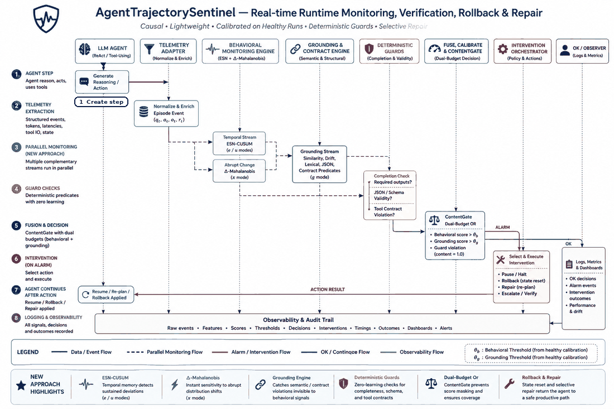

<p align="center">
  
</p>

<p align="center">
  
</p>

<p align="center">
  
</p>

<p align="center">
  <a href="https://arxiv.org/abs/2608.02464"></a>
  <a href="https://github.com/sunnydubey1111/agent-trajectory-sentinel/actions/workflows/ci.yml"></a>
  <a href="https://huggingface.co/datasets/sunnydubey1111/agent-trajectory-sentinel"></a>
  <a href="https://huggingface.co/spaces/sunnydubey1111/agent-trajectory-sentinel-demo"></a>
  <a href="LICENSE"></a>
  
</p>

Can a near-zero-cost temporal model, trained only on healthy runs, watch an
agent's step telemetry and raise a calibrated alarm at derailment onset —
steps before the task fails or the budget burns?

AgentTrajectorySentinel answers that with two layers that compose into a single gate:

1. **A behavioural monitor.** Echo-state-network CUSUM ensembles fit on
   healthy episodes only, scoring every step causally. It sees trajectory
   failures live, while the run is still going.
2. **Deterministic verification.** Checks that recompute a run's answer from
   the tool results that run actually received. No healthy null, no
   threshold, no calibration — and **0 observed false positives across the
   1,825 healthy episodes evaluated**.

On a real qwen2.5:7b booking agent, the two layers plus rollback-and-retry
take **task success from 52% to 73%** for about one extra model call per run.

The full system diagram — training, telemetry, both engines, the decision gate
and the repair path — is in [DESIGN.md](DESIGN.md#architecture).

<p align="center">
  <br>
  <a href="https://arxiv.org/abs/2608.02464"></a>
  <a href="https://youtu.be/a05n_000klE?t=0"></a>
  <a href="https://huggingface.co/datasets/sunnydubey1111/agent-trajectory-sentinel"></a>
  <br>
  <a href="CONTRIBUTIONS.md"></a>
  <a href="DESIGN.md"></a>
  <a href="CLAIMS.md"></a>
  <br>
  <br>
</p>

## Install

```
pip install -r requirements.txt          # development
pip install -r requirements.lock.txt     # pinned — required to reproduce a published number
```

Python 3.13+. The GRU/LSTM/TCN baselines additionally need
`torch==2.12.0+cpu` from the CPU wheel index; everything else runs without it.

## Quick start

```
py -m derail.experiments.run_experiment        # full synthetic study, ~3 min CPU
py -m derail.experiments.plots                 # figures from results/
py -m derail.verify.run_verification_study     # deterministic checks vs monitor, real traces
py -m derail.intervene.evaluate_repair_policies --from-csv   # repair study, re-analysis only
py -m derail.experiments.demo                  # live demo -> localhost:8765
```

The demo needs a local Ollama with `qwen2.5:7b` pulled. Everything else is
CPU-only and offline.

<details>
<summary>Full command list</summary>

```
py -m derail.experiments.run_experiment --seed 7   # replication -> results/seed7/
py -m derail.experiments.run_experiment --quick    # quarter-size integration run
py -m derail.experiments.run_multiseed             # 5-seed stability, ~35 min
py -m derail.experiments.run_ablation              # ESN hyperparameter sweep
py -m derail.experiments.run_benchmark             # per-step latency / footprint
py -m derail.experiments.run_fairness              # GRU/LSTM fairness diagnostics
py -m derail.experiments.run_hybrid_study          # hybrid ESN + Mahalanobis
py -m derail.experiments.collect_traces --mock-llm # pipeline dry run -> traces/_mock_dry_run/
py -m derail.experiments.run_real_traces           # evaluate collected real traces
py -m derail.verify.run_verification_study --holdout organic_demo7b_holdout
py -m derail.intervene.evaluate_repair_policies --parallel 4   # offline; real model calls
py -m verification.l3_serving_temperature          # serving vs provoking temperature
```

Every module also carries a self-contained smoke test:
`py -m derail.telemetry.generator`, `py -m derail.monitor.esn`,
`py -m derail.monitor.baselines`, `py -m derail.monitor.calibration`,
`py -m derail.monitor.escalation`, `py -m derail.evaluation.metrics`.

</details>

## The problem

An agent episode is a sequence of steps `t = 1..T`. Each step emits an
observable signal `x_t = [e_t; u_t; m_t]`: a semantic embedding of the step's
output, per-step aggregates of the token-logprob stream, and action metadata
(type, latency, output length, error flag). Episodes are healthy, or contain a
derailment onset at unknown step τ after which the trajectory distribution
shifts and the run ends in failure.

From **healthy episodes only**, learn a **causal online** monitor emitting a
score `s_t` and alarming at `τ̂ = min{t : s_t > θ}` — maximising detection lead
at a fixed false-alarm budget. Per-step compute must stay far below one LLM
call.

## Results

### Behavioural monitor — synthetic testbed, five seeds

The primary monitor is `esn_cusum_max`: one ESN-CUSUM detector per channel,
alarm on the max.

| | detection | steps saved | AUC |
|---|---|---|---|
| **`esn_cusum_max`** (primary) | **0.71 ± 0.07** | 4.6 ± 1.0 | **0.872 ± 0.015** |
| delta-Mahalanobis (best memoryless) | 0.37 ± 0.03 | 3.6 ± 0.4 | — |
| GRU (monolithic) | 0.60 ± 0.01 | — | 0.82 |
| LSTM (monolithic) | 0.61 ± 0.02 | — | 0.82 |
| TCN | 0.39 ± 0.04 | — | 0.74 |
| linear VAR-ridge | 0.61 | **6.1 ± 0.2** | — |

Mean ± std over five dataset seeds at a 5% false-alarm budget. Paired
permutation and exact McNemar tests against every memoryless baseline are
significant (vs delta-Mahalanobis: 130-vs-4 discordant detections,
McNemar p ≈ 1e-33).

Two findings worth the space. **Linear vector-autoregression is a strong
baseline** — it saves the most budget and actually leads the ESN by ~1.9 steps
— but it is far behind on detection. Much of the temporal signal is linear;
the ESN's edge is catching *more* failures, not catching them earlier. And
**the per-channel max-fusion wrapper, not the reservoir, carries most of the
margin**: giving a GRU that same wrapper lifts it to det 0.76 / AUC 0.873. The
wrapper is the transferable contribution; the ESN stays primary for its
false-alarm discipline (0.069 vs 0.113) and ~100× faster fit.

**The generality corpora are the most heavily filtered, and that cuts against
us.** An episode is discarded when it is too short to score or when an injection
never landed, and the rate is nowhere near uniform: `langgraph` **55.4%**,
`real` **53.8%**, `ollama_llama8b` **49.2%**, against `real_research7b` at
**1.7%**. The corpora carrying the cross-framework and cross-model claims are
exactly the ones where the most attempts were thrown away, so those breadth
results rest on a more selected sample than the headline ones do. Every
rejection is written to the corpus's `rejected.json` with its reason, and the
per-corpus table and the per-rule split are in
[`DATA_CARD.md`](DATA_CARD.md#what-the-acceptance-gate-discarded).

**It transfers to corpora we did not build.** Two external benchmarks, two
other labs, no retraining and no tuning — the monitors are fitted on each
corpus's own healthy runs and scored as-is.

On **ATBench** (arXiv:2604.02022, `py -m derail.experiments.run_atbench_study`)
the ESN reaches **AUROC 0.779** at **detection 0.311**, with the uncertainty
channel absent entirely. On **AFTraj-2K** (arXiv:2605.08715, `py -m
derail.experiments.import_aftraj`) it reaches **AUROC 0.745**: ranking survives
the move to another project's agents, frameworks and tasks.

**The horizon law predicted where it would fail, and held.** §6 claims detection
needs post-onset runway. On AFTraj that is testable directly, and the ESN
detects **0.509** of failures with ≥9 steps of runway against Mahalanobis' 0.170
— but only 53 of 771 AFTraj failures have that much, so pooled detection is
0.048. The mechanism predicted the number rather than excusing it, on a corpus
built by someone else. ATBench is the other side of the same law: its unsafe
runs are patterns of action rather than single wrong values, and detection rises
to 0.311.

**Two independent confirmations fall out of it.** ATBench's own failure-mode
labels reproduce the content blind spot the grounding channel exists for —
over-privileged actions **0.508** and unvalidated tool outputs **0.473** against
inaccurate information **0.038**; what the agent *does* is caught, what it
*says* is not. And the hybrid's advantage is confirmed to be pooled rather than
dominant: on ATBench delta-Mahalanobis sits at chance (0.457) and drags every
50/50 fusion to 0.438–0.463, against the ESN alone at 0.779.

For scale: AgentForesight-7B reports 66.44 Exact-F1 on AFTraj using an LLM
auditor at every step. This runs at **173 µs** with no model call, and cost is
the comparison we make — not accuracy.

Hypothesis verdicts, reported per seed rather than pooled: **H1** (temporal
advantage) and **H3b** (cost-accounted escalation) are supported at 4 of 5
seeds and not supported at seed 7; **H2** (channel complementarity) and
**H3a** (calibration) hold at all five.

The horizon law and H1 are **different kinds of evidence, and neither rescues
the other**. H1 is a per-seed test of whether the ESN beats the memoryless
baseline overall, and it fails at seed 7. The horizon law is a pooled
cross-dataset analysis — 1,002 injected episodes over 8 datasets — and it has
**never been computed per seed**: `hybrid_diagnosis.csv` carries no seed
column, so no per-seed claim is available for it in either direction. What
supports the law instead is that it holds out of sample, on AFTraj-2K, a corpus
built by another group (see below). Read H1's seed-7 failure as what it is: on
one seed the pooled advantage is not there, which is consistent with a law
saying the advantage depends on how much runway the failures happen to have.

**Cost.** ~219 µs median per step (p95 266 µs), 1.7 s to fit on 240 healthy
episodes, 4.0 MB of state — roughly three orders of magnitude below one agent
step. Latency is the one published figure that is not bit-reproducible: it
measures the machine, and a re-run on the same box moved it to 252 µs.
`results/tables/runtime.csv` is the source of record; the order of magnitude is
the part the claim rests on.

**What to actually deploy is a hybrid, not the ESN alone.** The ESN wins where
failures have room to develop and loses on corpora made of very short episodes,
so `derail.monitor.hybrid.recommended_monitor()` returns a fusion rather than
the ESN alone. It branches on the telemetry it is handed: on grounded (v4)
telemetry it returns the content gate, so the grounding detector is never
dropped; otherwise a 50/50 weighted ESN + delta-Mahalanobis fusion, upgraded to
the supervised logistic once ~20 labelled failures exist. Grand-mean AUROC over
the eight benchmark datasets (`results/tables/hybrid_benchmark.csv`):

| monitor | grand-mean AUROC | needs labels |
|---|---|---|
| `esn_cusum_max` alone | 0.802 | no |
| delta-Mahalanobis alone | 0.807 | no |
| **`hybrid_weighted50`** (label-free default) | **0.812** | no |
| **`hybrid_logistic`** (with ≥20 labelled failures) | **0.826** | yes |

**What labels buy: +0.014 AUROC.** That is the whole difference between the
best label-free fusion (0.812) and the supervised one (0.826), and it costs a
per-deployment corpus of at least 20 labelled failures — which has to be
recollected whenever the null is, because nothing here transfers across
deployments. Take the label-free default unless labelled failures are already
falling out of an injection harness you run anyway.

The mechanism is post-onset horizon. Over 1,002 injected episodes the ESN's
detection advantage over the memoryless distance grows monotonically with the
number of steps available after onset: **+0.09** at ≤3 steps, **+0.14** at 4–8,
**+0.40** at ≥9. Averaged over episodes the ESN never *loses* a band — its
margin just collapses when there is nothing to accumulate. Where the distance
wins is at the dataset level, on corpora that are almost entirely short-horizon
(`real_research7b` 0.848 vs 0.777). Full analysis: `results/hybrid_report.md`.

### Deterministic checks vs the behavioural monitor — real traces

Same episodes, same objective labels
(`results/tables/verification_vs_monitor.csv`):

| | checks | monitor |
|---|---|---|
| failures caught, T=0.2 (served) | 60% (**96%** with coverage) | 54% |
| false positives, T=0.2 | **0/63 = 0%** | 11/63 = 17% |
| failures caught, T=0.9 | 65% (**96%** with coverage) | 40% |
| false positives, T=0.9 | **0/38 = 0%** | 6/38 = 16% |

Recall is comparable at the served temperature; the difference is precision. A
deterministic check has nothing to be uncertain about, and needs no
recalibration when the model, temperature, toolset or framework changes.

The checks were written by inspecting failures in the serving arm, so that arm
cannot also be their test set. A further **120 episodes at disjoint task seeds**
were collected afterwards and scored with the checks frozen: 93% caught with
coverage, **0/64 false positives**, arithmetic errors 36/36. A **llama3.1:8b**
arm on the same 120 task seeds, nothing retuned: **110/110** failures caught,
0/10 false positives.

Three complementary checks, none subsuming the others — `total_consistency`
(wrong combination of what was looked up), `required_coverage` (work never
done), and `tool_contract`, which asks whether a tool result was ever valid
and therefore reports at the step the result *arrives*: **0 of 1825 healthy
episodes** trip it, and 215 of 218 flagged episodes are caught within one step
of onset.

### Does detection improve the agent?

Every flagged episode is rolled back to the same checkpoint and re-run under
each repair rung, paired on the identical prefix and task. Rollback is real: a
committed trace plus its seed rebuilds the conversation at step *k*, and every
step after is a fresh model call. Each rate is the mean of three independent
repeats (n=55 genuinely-wrong episodes):

| rung | recovery rate | vs `resample` | calls per recovery |
|---|---|---|---|
| `none` — untouched | 0% | — | — |
| `resample` — rollback + fresh sample | 16% | *the control* | 14.7 |
| **`located` — + which check failed, no values** | **45%** | **p=0.0005** | 6.4 |
| `generic` — + "re-check your work" | 36% | p=0.0347 | **5.8** |
| `specific` — + the finding, with values | 36% | p=0.0192 | 8.1 |
| `recompute` — + "use the calculator" | 28% | p=0.17 (n.s.) | 7.2 |
| `adaptive` | 21% | p=0.61 (n.s.) | 10.6 |

Net over all 120 episodes, charging each policy for any correct run it broke:
`located` takes success **52% → 73%**, recovering 25 failures and breaking
**zero** correct runs. Retry luck is controlled for — plain resampling alone
recovers 16%, so only the margin above that is credited to the repair.

Asking for a re-check is what works, and *naming the failing check* works
best. Supplying the recomputed answer buys nothing: `located` states no
computed value at all and still recovers at least as much as `specific`.

Cost: ~7.8 s added to a flagged run; the repair fires on 46% of runs, so
amortised that is ~1.3 extra calls and ~3.6 s per run.

### Hallucination

The project's core goal was hallucination-onset detection, and the measurement
reshaped the delivery. Across **91 real episodes** and three elicitation
methods — deliberate attempts to make the model invent a figure — qwen2.5:7b
and :3b produced **zero genuine numeric fabrications**: lacking a number, they
abstain or mis-add rather than invent. That is good alignment, and it means
hallucination cannot be elicited on demand.

Two different denominators appear below and they are not in conflict. This
paragraph is about *elicitation* (91 episodes, 0 fabrications). The organic
corpora are a separate, larger set collected without any attempt to provoke:
175 episodes, of which the objective labeller flags 9 as hallucinated and **2
as fabricated inputs** — the class the grounding verifier targets. Zero under
elicitation, two in the wild.

So hallucination onset is caught by the right mechanism rather than the
statistical monitor: a deterministic per-step **numeric-grounding verifier**
([`derail/monitor/grounding_verify.py`](derail/monitor/grounding_verify.py))
that checks whether every monetary figure the agent asserts traces to a tool
result it actually received. It needs no ground-truth answer, so it is
deployable online. Measured: **0 false positives across 89 real healthy runs**
(0/25, 0/55, 0/9), and on a provoked-fabrication corpus that finally powers the
class (11 ungrounded-input fabrications in 120 episodes) it catches **0.55**.
Specific, about half sensitive — stated as measured.

### Real traces and other frameworks

A 187-episode live gemini-2.5-flash corpus (`results/tables/real_traces.csv`):
the channel-max monitor leads every other monitor on real agent behaviour at
**AUC 0.840 / detection 0.71**, computed on a held-out split of **79 injected
and 15 healthy** episodes drawn from it — not on all 187. With 15 healthy test
episodes one false alarm is worth 6.7 points, which is why the realized FA of
0.20 should be read as an order of magnitude. Per class: looping 1.00, tool
cascade 0.83, goal drift 0.77, context corruption 0.29.

**Gemini episodes, once: 330 collected, 143 exported, headline computed on the
other 187.** The 187 are listed in the top-level `traces/manifest.json`; the 143
the data card counts are `real` (18) plus `real_gemini_long` (125). Every count
in `DATA_CARD.md`, in the claim ledger and in the Hugging Face export enumerates
corpora by globbing `traces/*/manifest.json`, which matches subdirectories only,
so the 187 appear in none of them — they are committed here and are not in the
HF dataset. `traces/NOTICE_gemini.md` covers all 330.

Its realized false-alarm rate is **20%**, and that number should be read for
what it is. The test split holds 15 healthy episodes, so a single episode moves
the rate by 6.7 points; the validation split holds 16, and an empirical
quantile over 16 episodes *cannot* deliver a 5% budget at all — the
order-statistic floor is 1/(n+1) = 5.9%, and reaching 5% needs n >= 19.
`pick_threshold` warns rather than silently missing the budget. On this corpus
the budget is unreachable, not merely missed, and no monitor here should be
described as respecting it.

The same stack runs on LangGraph, AutoGen and native-Ollama traces. Those runs
established an **operating envelope**, then confirmed it causally: with tiny
healthy sets and episodes barely longer than the monitor's 3-step washout,
detection sits near chance; re-collecting with the requirements met
(qwen2.5:7b, 60 healthy episodes per source, T=5–8) lifted every source by
+0.15–0.24 AUC with nothing else changed.

## Live demo

The clip at the top of this page is one such run: the agent works its task, a
failure is injected mid-run, the monitor's score crosses the alarm line, and
the run is halted and explained.

**Watch it instead:** the
[real time demo](https://youtu.be/a05n_000klE?t=0) covers the problem, the
architecture, the cost and the measured limits, and ends with the live demo
detecting and repairing a real failure (the demo starts at 18:12).

**Nothing to install:** the
[Hugging Face Space](https://huggingface.co/spaces/sunnydubey1111/agent-trajectory-sentinel-demo)
replays real recorded runs through the real monitor, step by step. It is a
static page, so the scores are computed when the page is built rather than in
your browser — the page says so. Rebuild it with
`py -m devtools.hf_space --build`.

The full demo below is the live one, and needs a local model.

`py -m derail.experiments.demo` serves **AgentTrajectorySentinel Live** at
`http://localhost:8765`. A real qwen2.5:7b agent works a long booking task
while the shipped monitor scores every step. Five buttons inject a real
failure mid-run — loop trap, goal hijack, tool failures, data corruption,
hallucination — and on alarm the run is either halted for inspection or
repaired, your choice via a toggle. An explainability panel answers "why" from
the monitor's own attribution, not canned text.

Nothing is mocked or hardcoded: θ is recomputed from data at startup, and all
post-injection behaviour is real model output. Injected payloads are displayed
verbatim, and when a check *misses*, the UI says which case occurred and why.

**Rehearsal of record** (`py -m derail.experiments.demo --rehearse`, live
qwen2.5:7b, all five injections plus two healthy controls). θ is calibrated at
run time from 58 retained healthy traces — 62 of 120 are excluded because they
priced the trip but skipped the weather lookups, or stated the wrong total —
and the self-calibrating baseline reports `trusted` at a realized false-alarm
rate of 8.6% against its 10% budget:

| scenario | injected | alarm | verdict |
|---|---|---|---|
| healthy ×2 | — | — | clean, peak 0.18 |
| `looping` | step 4 | step 6 | detected, +2 |
| `goal_drift` | step 4 | step 5 | detected, +1 |
| `tool_cascade` | step 4 | step 7 | detected, +3 |
| `context_corruption` | step 4 | — | caught by `tool_contract` at step 4 |
| `grounding_loss` | step 4 | — | caught by the grounding check |

**0 missed, 0 false alarms.** Two classes are caught by the deterministic layer
rather than the behavioural monitor, which is the design: `grounding_loss` lives
in the content, and this world's tool results are too terse for garbling to
carry statistical mass — so the contract check gets there first, at the step the
malformed result arrives.

Measured over five injection classes × five task seeds with halting off
(`results/tables/alarm_repair.csv`, n=25 live episodes,
`py -m derail.experiments.demo --alarm-repair-matrix`): **every behavioural
alarm is followed by a repair attempt** — 21 of 21 here, and 18 of 18 in an
earlier independent run of the same matrix. `goal_drift` is the class a retry
fixes, repairing **4 of 5**. Where the tool layer itself is broken the retry
cannot win, and the value of the intervention is ending the episode fast: a
loop trap exits at exactly 10 steps in 5 of 5 runs, against 30 before the
circuit breaker existed.

Because this is a live study, per-class alarm rates move between runs — the two
samples above differ on `grounding_loss` (0/5 vs 2/5) and `context_corruption`
(3/5 vs 4/5). Read those per-class figures as a sample, not a constant. Runs
that never alarm behaviourally can still be repaired, driven by the answer or
contract checks rather than by the monitor; that is the design, not a
spurious interruption.

## Layout

```
DESIGN.md                        implementation contract + amendments
derail/common.py                 channel layout, Episode, OnlineMonitor ABC
derail/config.py                 secure API-key resolution (OS vault > env > .env)
derail/telemetry/generator.py    healthy simulator + 5-class failure injector
derail/telemetry/adapter.py      real-trace JSONL -> Episode converter
derail/monitor/esn.py            ESN ensemble, per-channel max fusion (primary)
derail/monitor/baselines.py      cosine/self drift, entropy, Mahalanobis, iForest
derail/monitor/seq_baselines.py  VAR-ridge, GRU, LSTM, TCN (same one-class protocol)
derail/monitor/baseline.py       self-calibrating rolling healthy reference
derail/monitor/grounding_verify.py  per-step numeric-grounding verifier
derail/monitor/calibration.py    label-free (healthy-ECDF) + oracle isotonic
derail/monitor/escalation.py     modeled judge, 4 policies, cost accounting
derail/verify/checks.py          deterministic answer + coverage + contract checks
derail/intervene/                rollback and repair-policy evaluation
derail/evaluation/               metrics, protocol, paired significance tests
derail/experiments/              study runners, collectors, plots, live demo
```

## Failure classes

The injector fixes ground-truth τ, severity and onset ramp.

| class | designed signature |
|---|---|
| `goal_drift` | gradual semantic rotation toward a distractor goal; confident |
| `looping` | cycling among recent states; repeated actions; entropy drops |
| `tool_cascade` | error flags + latency inflation + retry ping-pong |
| `grounding_loss` | semantics stay plausible; uncertainty channel shifts |
| `context_corruption` | AR coherence collapses; dynamics unpredictable |

Low-severity onsets ramp in slowly and are genuinely hard; injected pre-τ steps
are statistically indistinguishable from healthy ones.

## Reproducing

Published numbers need the pinned environment, not the loose bounds in
`requirements.txt`:

```
pip install -r requirements.lock.txt
py -m pytest -m "not network and not ollama"   # the offline gate
py -m devtools.claims_ledger --check           # every headline number vs its artifact
py -m devtools.behavior_snapshot --check       # end-to-end behavioural tripwire
```

Full detail — machine, models, seeds, settings and the command behind each
result — is in [`REPRODUCE.md`](REPRODUCE.md).

**Guarantees.** Monitors fit on healthy train only; thresholds from healthy val
only; the labeled cal split feeds only the isotonic oracle and the escalation
operating point; every reported number is test. Every score at step *t* is a
function of `x_1..x_t` plus fit-time quantities — no lookahead. Monitors are
compared by expected steps saved per failure episode, so misses count zero and
the comparison is survivorship-free. One master seed reproduces results
bit-for-bit.

**Plugging in your own traces** is an adapter problem, not a rewrite —
everything above the telemetry layer consumes only `Episode` objects:

```python
from derail.telemetry.adapter import load_trace_jsonl
healthy = [load_trace_jsonl(p) for p in Path("traces/healthy").glob("*.jsonl")]
monitor.fit(healthy)                       # one-class, as in the study
```

Re-fit on healthy runs from your own source; do not mix a simulator-trained
monitor with real traces.

## Future work

Each item below is a measured gap with a number attached, and the next thing
worth building. Sources in [`CLAIMS.md`](CLAIMS.md).

- **Repair coverage is partial.** `located` recovers 45%, leaving 55%
  unrecovered. `goal_drift` is the only class a retry fixes (2 of 5); broken
  tool layers escalate instead, and a contract violation is never repaired.
- **Hallucination detection is specific but only half sensitive.** The
  grounding verifier catches 0.55 of provoked fabrications — 6 of the 11
  ungrounded-input fabrications the provocation produced — at 0 false positives
  in 89 healthy runs, and that number exists only under provocation. Unprovoked
  fabricated inputs are 2 in 175 organic episodes, below the pre-registered
  floor of 10, so no unprovoked claim is made.
- **Two repair rungs did not work.** `recompute` 28% (p=0.17) and `adaptive`
  21% (p=0.61) do not beat retry luck. Kept as comparison arms.
- **Monitors do not transfer across deployments.** qwen2.5:7b → llama3.1:8b
  sits at chance (AUROC 0.527) where recalibrating on the target reaches 0.885;
  7b → 3b falls below chance. The null must match the serving distribution.
- **The judge-LLM claim is halved by measurement.** A real gemini-2.5-flash
  judge scores p_detect 0.548 / p_false 0.052 against the stipulated 0.90 /
  0.02. The call saving survives; the detection recovery does not.
- **On live traces the false-alarm budget is unreachable, not just missed.**
  16 healthy validation episodes put the floor at 5.9%; realized FA is 20% over
  15 test episodes. Read those rates as orders of magnitude.
- **Context corruption is the weakest class** (0.29). Corruption that keeps a
  legal shape needs an external reference.
- **Adversarial robustness is a measured limit.** A white-box adversary shaping
  all three channels drops detection to the floor; a tamper check closes that,
  and an adaptive replay defeats the check.
- **The testbed is synthetic and the primary monitor was picked on the headline
  seed.** H2's direction is partly by construction; four untouched-seed
  replications guard the selection and are reported per seed.
- **Coverage is conditional on telemetry.** No structured tool results, no
  semantic or grounding channel. Logprobs barely matter (AUROC +0.000).

## Documentation

- [`CONTRIBUTIONS.md`](CONTRIBUTIONS.md) — what this project establishes
  scientifically, in eight sections, each result named with the artifact it is
  computed from and its bounds stated alongside it.
- [`CLAIMS.md`](CLAIMS.md) — claim-to-evidence ledger: every headline number
  above, the denominator it was computed over, the artifact it is read from,
  and the command that regenerates it.
  `py -m devtools.claims_ledger --check` recomputes every one of them — value
  and denominator both — and fails on drift. The ledger prints its own count,
  so this sentence cannot go stale.
- [`USER_GUIDE.md`](USER_GUIDE.md) — a walkthrough of the live demo: what to
  press, what to look for on the chart, the Why panel and the savings banner,
  and what does not work yet.
- [`REPRODUCE.md`](REPRODUCE.md) — models, seeds, hardware, package versions,
  settings, and the exact command behind each result.
- [`DATA_CARD.md`](DATA_CARD.md) — all 25 corpora: sizes, models, injected vs
  organic, episode lengths, channel availability. The same corpus is published
  on Hugging Face as
  [`sunnydubey1111/agent-trajectory-sentinel`](https://huggingface.co/datasets/sunnydubey1111/agent-trajectory-sentinel),
  one row per episode plus the raw traces (`py -m devtools.hf_dataset --build`).
- [`CHECKSUMS.md`](CHECKSUMS.md) — SHA-256 coverage and the root digest.
- [`DESIGN.md`](DESIGN.md) — per-module low-level contract, the telemetry
  schema every collector writes, and the numbered amendments.
- Papers — [`paper/main.tex`](paper/main.tex) (conference format; this is the
  source of the preprint at
  [arXiv:2608.02464](https://arxiv.org/abs/2608.02464), flattened for upload by
  `py -m devtools.arxiv_package`) and
  [`paper/paper.md`](paper/paper.md) (full length, converted to
  [`paper/paper.tex`](paper/paper.tex) by `py -m devtools.md_to_latex`). The
  PDFs are build products rather than committed files: `cd paper && latexmk
  -pdf main.tex` produces them from a clean checkout, and
  [`REPRODUCE.md`](REPRODUCE.md) lists both commands.
- `results/` — every table and figure the claims above cite.
- [`LICENSE`](LICENSE) (MIT) and [`CITATION.cff`](CITATION.cff).

## Licensing

**MIT covers what this project wrote**: all source under `derail/`,
`verification/`, `devtools/` and `tests/`, the trace *format* and schema, the
result tables and figures, and every document here. See [`LICENSE`](LICENSE).

**MIT does not cover things this project only recorded or called.** A licence
cannot grant rights the licensor never held, so these keep their own terms:

| what | terms |
|---|---|
| `qwen2.5:7b` / `qwen2.5:3b` model output (2,247 episodes) | Apache-2.0 — no condition on redistributing output |
| `llama3.1:8b` model output (433 episodes) | Llama 3.1 Community License + its Acceptable Use Policy. **Built with Llama.** |
| `gemini-2.5-flash` model output (330 episodes) | Gemini API Additional Terms. Reuse must not train language models or build anything competing with the Gemini API or Google AI Studio — clause quoted and scope itemised in [`traces/NOTICE_gemini.md`](traces/NOTICE_gemini.md) |
| Cassette-replayed weather results | Open-Meteo, CC BY 4.0 |
| Cassette-replayed search snippets | Wikipedia, CC BY-SA 4.0 |
| arXiv / GitHub tool results | uncopyrightable facts — titles, identifiers, repository names, star counts |

**External benchmarks are not redistributed here at all.** The AFTraj-2K
(`ZBox008003/AFTraj`) and ATBench (`AI45Research/ATBench`) comparisons in
[`CLAIMS.md`](CLAIMS.md) are computed from corpora this repository downloads
into gitignored directories and never commits. The *measurements* are ours and
are MIT; the underlying trajectories are the original authors' and are governed
by whatever terms those datasets carry, which anyone importing them should
check at the source.

Per-corpus detail, including which episode counts each condition applies to,
is in [`DATA_CARD.md`](DATA_CARD.md#licensing).
